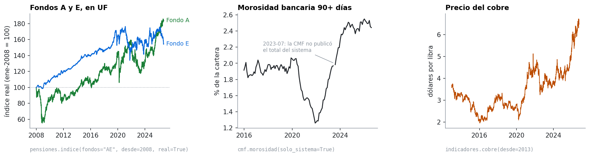

🇨🇱 [Español](README.md) · 🇺🇸 **English**

# datoschile

[](https://github.com/Rxyxs/datoschile/actions/workflows/tests.yml)
[](https://github.com/Rxyxs/datoschile/actions/workflows/fuentes.yml)


**Chilean public data, clean and in a DataFrame, in one line.** UF (Chile's inflation-indexed unit), dollar, copper, CPI, policy rate, IMACEC and unemployment; pension fund unit values and assets by fund and administrator (AFP); and bank delinquency by bank from the CMF, the financial regulator.

```python
import datoschile as dc

dc.indicadores.uf(desde=2020)                         # daily UF, corrected
dc.indicadores.cobre(desde=2024)                      # copper price per pound
dc.pensiones.valor_cuota(fondos="AE", desde=2020)     # by day, fund and AFP
dc.pensiones.indice(fondos="A", desde=2008, real=True)  # fund index in UF
dc.cmf.morosidad(desde="2020-01")                     # monthly panel by bank
```

The API is in Spanish, like the sources: `desde`/`hasta` mean from/to.



## Why it exists

These sources are public and need no key, but none of them can be used as published. Each problem below came up while working with real data in other projects ([pensions](https://github.com/Rxyxs/chile-pension-fund-switching-cost), [bank delinquency](https://github.com/Rxyxs/chile-banking-delinquency-cmf)), and the library solves it once so nobody else has to find it:

| Source | Real problem | What datoschile does |
|---|---|---|
| UF (mindicador.cl) | On 29 and 30 December 2014 the "UF" is **608.15 and 607.38**: the US dollar leaked into the series. A deflated index jumps ×40 and back. | Drops any day that moves more than 1% from the last valid value (the UF never does) and fills it in. |
| UF (mindicador.cl) | 2015-07-11 appears five times; 2015-12-12 and 2015-12-31 are missing. | Collapses identical copies, **fails if two copies disagree**, and interpolates geometrically, which is how the UF is computed. |
| Unit values (pension regulator) | The header saying which AFP sits in each column **changes 31 times** in Fund C's file. Read with a single header, columns silently misalign. | Re-reads the header every time it appears. |
| Unit values | Each AFP's unit value starts at a different level: averaging them is meaningless. | `indice()` weights each AFP's return by its previous-day assets and, with `real=True`, deflates by the corrected UF. |
| Delinquency (CMF) | 128 Excel files in **three different layouts** between 2016 and 2026, and banks that merge or get renamed. | Detects each file's layout, joins mergers into one series, and fails on any layout it doesn't know. |
| Delinquency (CMF) | In the 2023-07 file the system row is `---`. | Leaves it as `NaN`: it does not make up a value. |

Every cleaning rule has a test that reproduces the original problem.

## Installation

```bash
pip install git+https://github.com/Rxyxs/datoschile
```

Requires Python 3.10+. Depends only on pandas, requests and openpyxl.

## What's inside

**`indicadores`**: any series from [mindicador.cl](https://mindicador.cl), which mirrors Central Bank, INE and SII series.

| Function | Returns |
|---|---|
| `uf(desde, hasta)` | Corrected daily UF (one value per calendar day). What was corrected is in `df.attrs["informe"]`. |
| `dolar(...)`, `cobre(...)` | Observed dollar and copper per pound, business days. |
| `serie(codigo, desde, hasta)` | Any of: `uf`, `ivp`, `dolar`, `euro`, `utm`, `ipc`, `tpm`, `imacec`, `tasa_desempleo`, `libra_cobre`, `bitcoin` (details in `indicadores.SERIES`). |

**`pensiones`**: daily unit values and assets since 2002, funds A–E.

| Function | Returns |
|---|---|
| `valor_cuota(fondos, desde, hasta, afps)` | One row per date, fund and AFP: `valor_cuota` and `valor_patrimonio`. |
| `indice(fondos, desde, hasta, real)` | Fund index (all AFPs weighted by assets), base 100. |

**`cmf`**: 90+ day delinquency, monthly, since 2016.

| Function | Returns |
|---|---|
| `morosidad(desde, hasta, solo_sistema)` | One row per month and bank: % delinquent in `total`, `clientes`, `comercial`, `personas`, `consumo`, `vivienda`, plus the delinquent amount in CLP millions. |

`desde` and `hasta` take a year (`2020`), a month (`"2020-03"`) or a date (`"2020-03-15"`).

### From the terminal

```bash
datoschile uf --desde 2020 -o uf.csv
datoschile serie libra_cobre --desde 2024
datoschile indice --fondos A --desde 2008 --real -o fund_a_real.csv
datoschile morosidad --desde 2020-01 --solo-sistema
```

## Cache

A year that has ended doesn't change, so it is stored in `~/.cache/datoschile` and never requested again; the current year (and the CMF's last three months, which may be revised) is always downloaded fresh. The first full UF download takes about 2 minutes because mindicador is slow; after that, closed years load from disk in hundredths of a second and only the current year is fetched again (a few seconds). Use another folder with `DATOSCHILE_CACHE=/path`; skip the cache with `cache=False` or `--sin-cache`.

## Checked against the sources

Besides the offline tests (run on every change), a separate set downloads real data and checks known values. It runs **every week** on GitHub Actions, to find out a source changed its format before its users do:

- UF on 2008-12-31 = 21,452.57, the value published by the SII.
- The 2014 dollar leak is detected and corrected.
- Fund A falls between 20% and 45% in 2008.
- System delinquency in February 2020 is 2.04%.

```bash
pip install -e ".[dev]"
pytest                 # offline
pytest -m red          # against the real sources
```

Over the full history, the library reproduces the figures of the projects it came from: Fund A falls 24.6% and Fund E 3.7% between 20 February and 23 March 2020, and system delinquency goes from 2.04% (Feb 2020) to 1.26% (Dec 2021) and 2.44% (Aug 2026).

## Sources and caveats

- **mindicador.cl** is a third-party aggregator, not the official publisher. For regulatory use, check against the [Central Bank](https://si3.bcentral.cl/siete) or the [SII](https://www.sii.cl/valores_y_fechas/).
- **Pension regulator (Superintendencia de Pensiones)**: [unit values and assets](https://www.spensiones.cl/apps/valoresCuotaFondo/vcfAFP.php). The series includes weekends with nearly flat values; for volatility models, keep business days only.
- **CMF**: [delinquency statistics](https://www.cmfchile.cl/portal/estadisticas/626/w4-propertyvalue-28914.html).

The library downloads at a moderate pace (a pause between requests) and caches what doesn't change, to avoid loading public services.

## License

MIT — see [LICENSE](LICENSE).

## Author

**Pablo Reyes** — [github.com/Rxyxs](https://github.com/Rxyxs)
